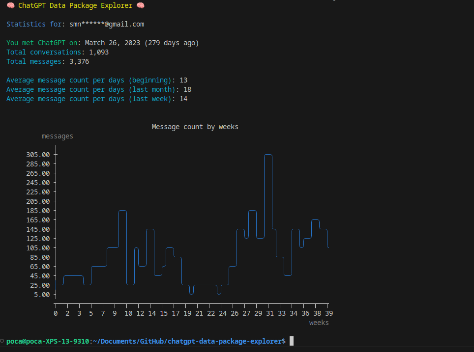
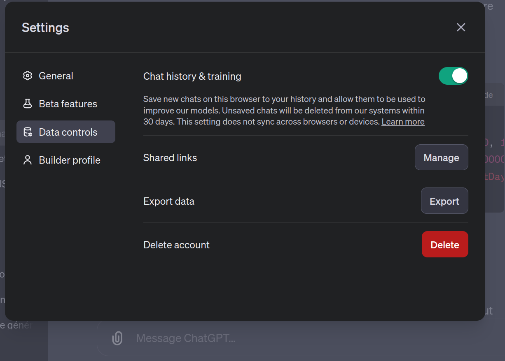

# 🧠 ChatGPT Data Package Explorer

Get statistics about your ChatGPT usage.

* If everyone also asks you, "So what about you, do you really find ChatGPT useful? Do you use it a lot?".  
* And you too answer "yes... I seem to spend a lot of time on it".  
* Now you know exactly.

ChatGPT Data Package Explorer uses the personal data package generated by OpenAI that you can request [here](#request-the-data).

## 🔅 Demo



## 📦 Installation

Node.js is required.

### Clone the repo

```bash
git clone https://github.com/Androz2091/chatgpt-data-package-explorer
cd chatgpt-data-package-explorer
```

### Install dependencies

```bash
yarn install
```

### Request the data

* Navigate to https://chat.openai.com
* Click on your profile picture in the top right corner
* Click on "Settings"
* Click on "Data Controls"
* Click on "Export"



### Copy the data package

* Unzip the downloaded file
* Move its content to the `data` folder

### Start the script

```bash
node index.js
```
